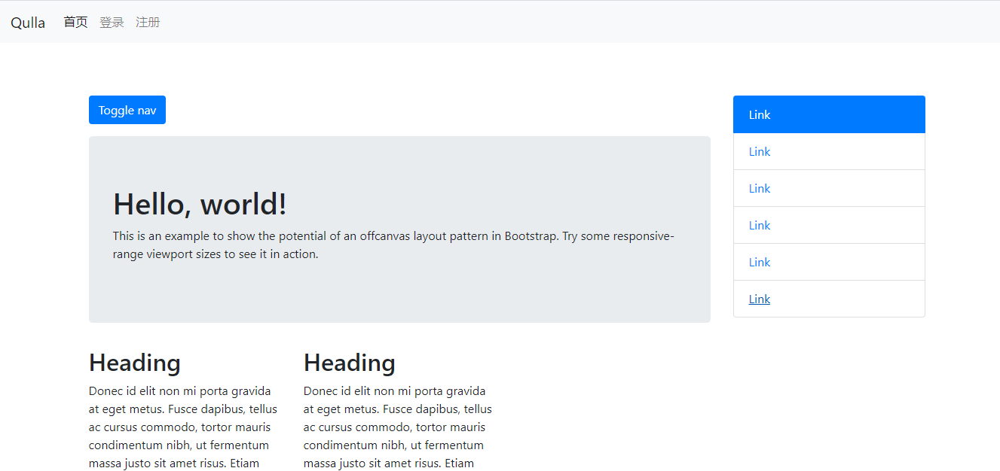
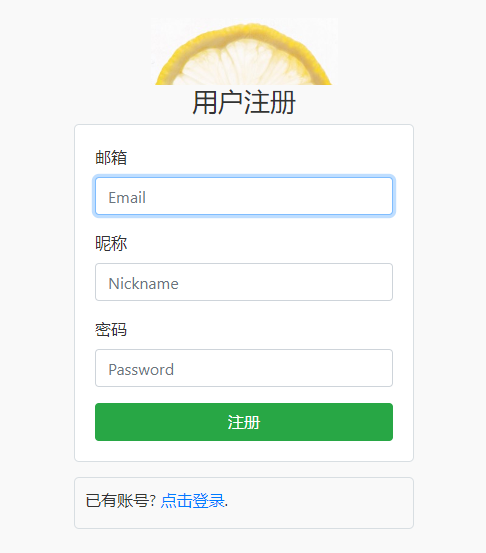

### 🍇多人博客平台（node + mongodb）

#### 简介

- 基于Node.js(express) + mongoDB（mongoose） 的多人博客平台项目，实现简单的登录，注册，退出等功能。
- 功能很简单，很适合入门的童鞋。
- 此项目关注于后端的搭建，以及交互，项目代码逻辑清晰，涵盖各种Nodejs关键点。

####  效果

- **首页**

- **注册页面**

- **登录页面**

- **登录成功页面**

***************

####  初始化项目以及需要用到的一些插件

```
# 初始化
npm init  -y 

# mongoodb的三方包(数据库)
npm i mongoose

# Node框架
npm i express
npm i express-art-template

# 模板引擎
npm i art-template

# 用户密码加密包
npm  i blueimp_md5

# express中的session包
npm i express-session

# express配置post请求包
npm i body-parser
```

*****************

####  目录结构

```
├── main.js		//项目入口文件
├── node_modules     	//第三方包
├── views       	//存储视图目录
├── models      //数据库需要的模板文件
├── public	 	//公共静态资源
├── README.md        	//项目文档说明
├── router.js		//路由
├── package.json        //包描述文件
└──package-lock.json    //第三方包版本锁定文件
```

####  路由设计

| 路径      | 方法 | get参数 | post参数                | 权限 | 备注         |
| :-------- | :--- | ------- | ----------------------- | ---- | ------------ |
| /         | GET  |         |                         |      | 渲染首页     |
| /register | GET  |         |                         |      | 渲染注册页面 |
| /register | POST |         | email,nickname,password |      | 处理注册请求 |
| /login    | GET  |         |                         |      | 渲染登录页面 |
| /login    | POST |         | email,password          |      | 处理请求     |
| /logout   | GET  |         |                         |      | 处理退出     |


